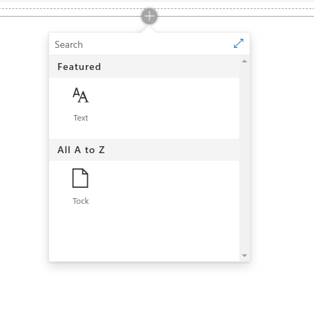
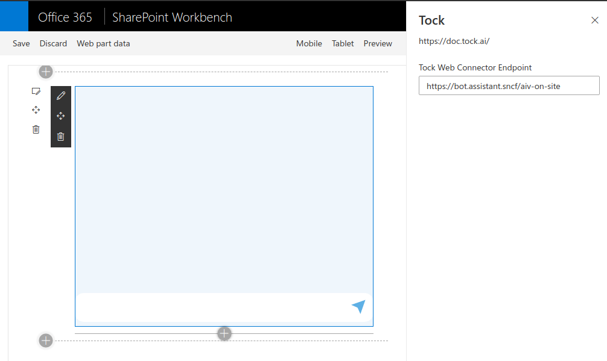
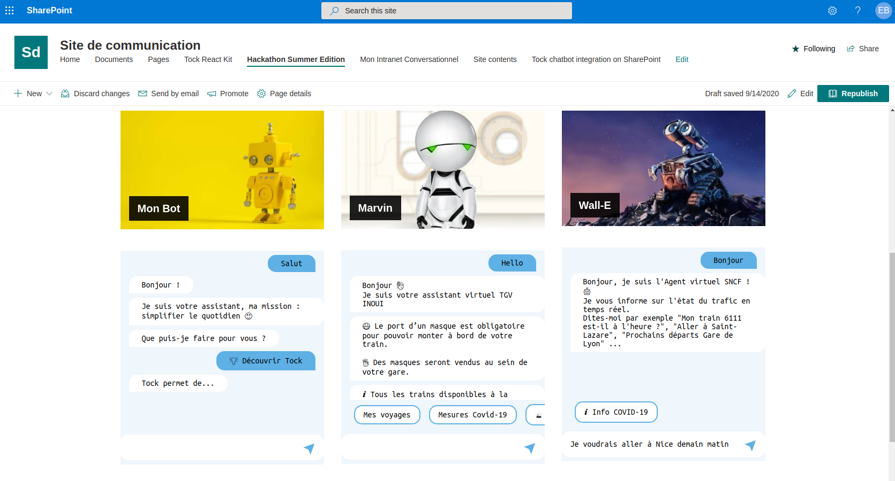

# tock-sharepoint

SharePoint WebPart for TOCK

## Summary

It is possible to integrate with one or multiple chatbots within a page, using SharePoint WebParts for Tock. Each bot integration is responsive and adapts to the SharePoint page layout (wide, columns, etc.) and user device (desktop, mobile, landscape...).

Add a new web part

Configure your bot endpoint

Multiple chatbots within a page 

## Used SharePoint Framework Version

## Applies to

- [SharePoint Framework](https://aka.ms/spfx)
- [Microsoft 365 tenant](https://docs.microsoft.com/en-us/sharepoint/dev/spfx/set-up-your-developer-tenant)

> Get your own free development tenant by subscribing to [Microsoft 365 developer program](http://aka.ms/o365devprogram)

## Prerequisites

> Try to Create your first bot with Tock Studio [Tock Studio](https://doc.tock.ai/tock/en/guide/studio/)
> 

---

## Minimal Path to Awesome

- Clone this repository
- in the command-line run:
  - Install dependencies

    `npm install`

  - Start hot reload server

    `gulp serve`

  - Prepare the web part resources to deploy

    `gulp bundle --ship`

  - Package solution

    `gulp package-solution --ship`
    
  - Deploy generated solution (sharepoint/solution/tock-sharepoint.sppkg) to sharepoint application catalog 
